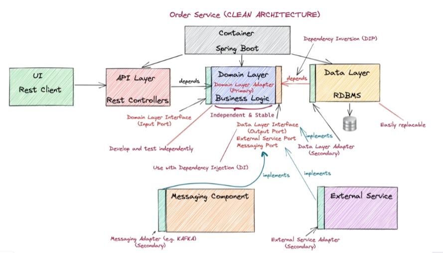
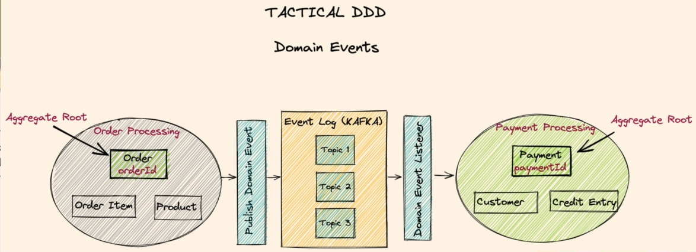
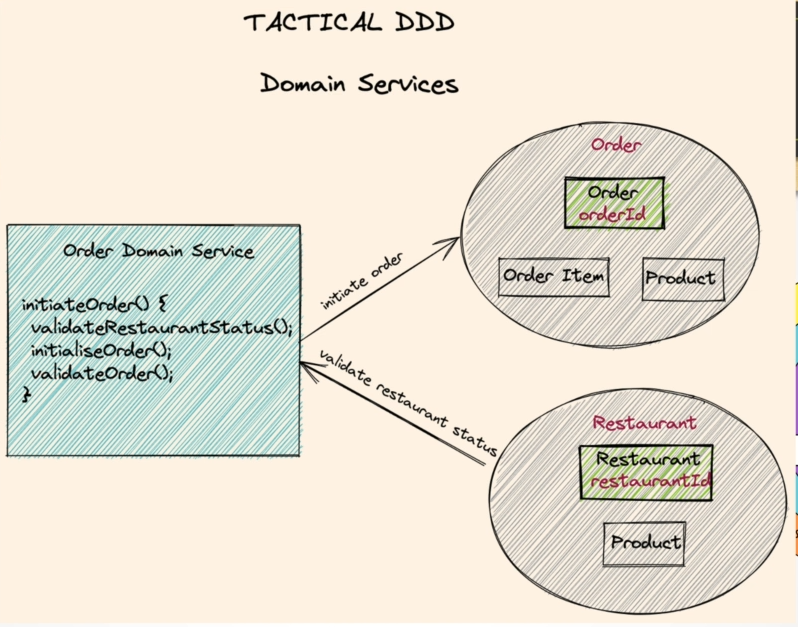
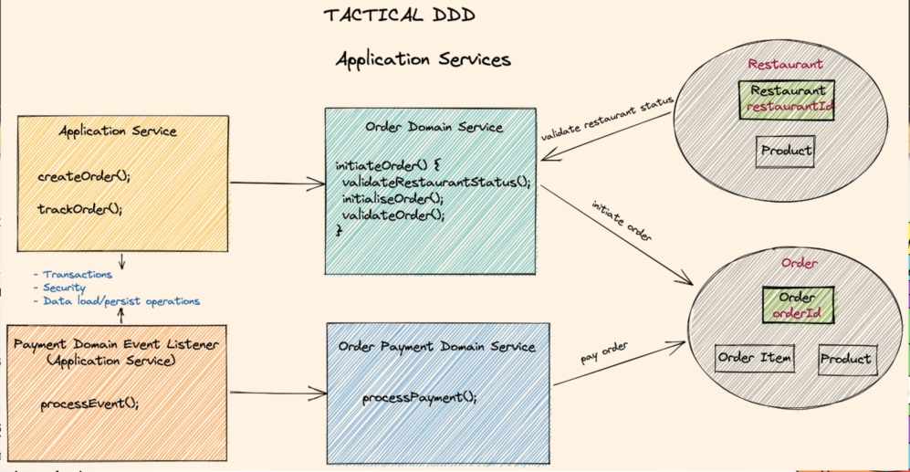
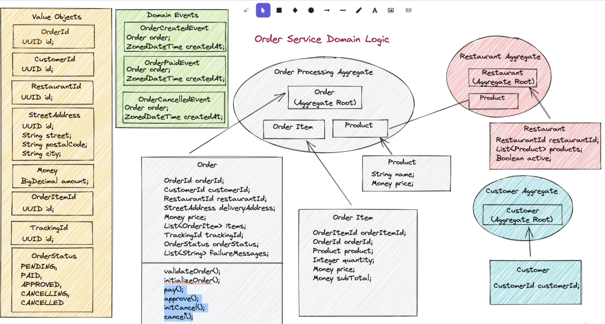
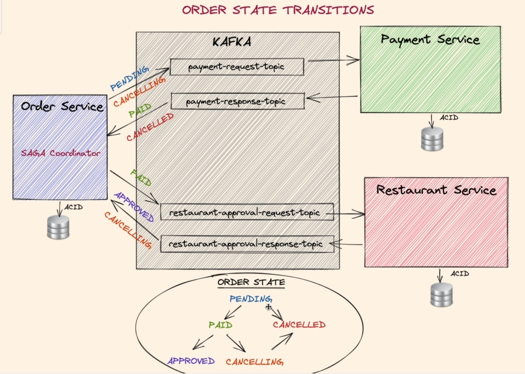

# **VMO Microservice Food Ordering System**

**Generate Graph**: `mvn com.github.ferstl:depgraph-maven-plugin:4.0.1:aggregate -DcreateImage=true -Dscope=compile "
-Dincludes=com.food.ordering.system*:*"`

## _Order Service_

### Domain Event

### Domain Service

### Application Service

### **1. Implementing Domain Events in Order Service domain layer**

### Question?

#### Where to fire the event ? `--> In Application Service. Domain Layer should not know about how to fire the event`.

#### Where to create the event ? `--> Domain Service or Entities`